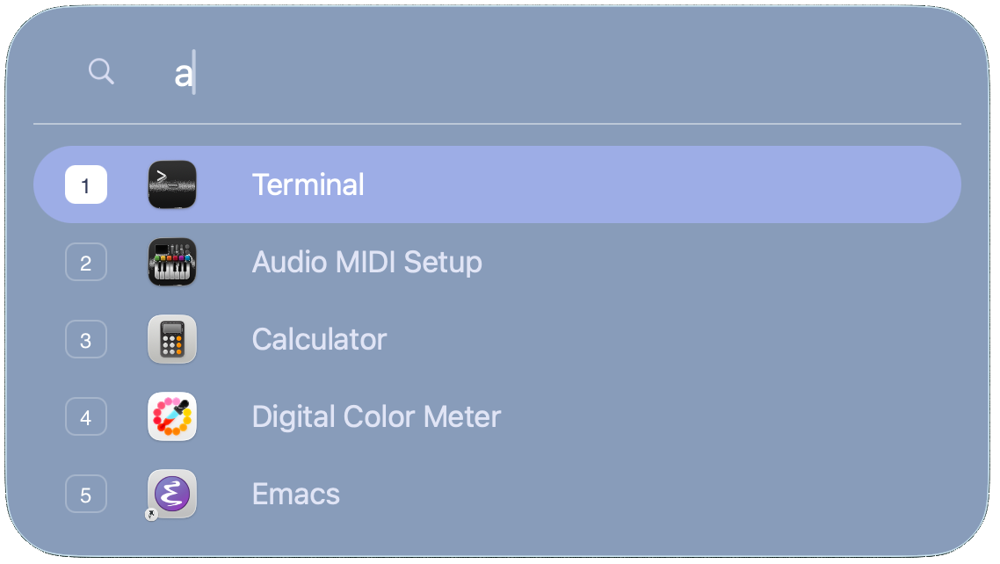

<p align="center">
  
</p>

# zlaunch

Zlaunch is a minimal app launcher for MacOS. Press a global hotkey, type part of an app name, and launch the highlighted result with Enter or Cmd-[1..5]. Matches occur from any substring in the app name. Most common apps get sorted to the top.

zlaunch discovers local `.app` bundles at startup, filters them in process, and launches selections with `/usr/bin/open`.

<p align="center">
  
</p>

## Features

- Global hotkey, default `ctrl-space`
- Substring app search, case insensitive
- Arrow-key selection with a five-row scrolling result list
- `cmd-1` through `cmd-5` to launch visible rows
- `tab` autocomplete to the longest common app-name prefix
- Light and dark mode styling
- No Dock icon while running

## Build

Requires Zig `0.16.0` and macOS.

```sh
zig build
```

Run the launcher:

```sh
./zig-out/bin/zlaunch
```

Show the launcher immediately when launching the app::

```sh
./zig-out/bin/zlaunch --now
```

## Usage

- `ctrl-space`: show zlaunch
- Type to filter apps
- `up` / `down`: move selection
- `return`: launch selected app
- `cmd-1` ... `cmd-5`: launch a visible row
- `tab`: autocomplete common prefix
- `esc`: dismiss

If you want zlaunch to stay running, run it from your shell with `&` to background it:

`$ zlaunch & `


## Config

On startup, zlaunch creates:

```text
~/.config/zlaunch/zlaunch.json
```

Default config:

```json
{
  "version": 1,
  "hotkey": "ctrl-space",
  "paths": [
    "/Applications",
    "/Applications/Utilities",
    "/System/Applications",
    "/System/Applications/Utilities",
    "~/Applications",
    "~/Applications/Chrome Apps.localized"
  ]
}
```

Supported modifier names include `cmd`, `command`, `apple`, `shift`, `option`,`alt`, `ctrl`, and `control`. Supported keys are letters, digits, `space`,`tab`, `enter`/`return`, and `esc`/`escape`.

Example:

```json
{
  "version": 1,
  "hotkey": "ctrl-option-m",
  "paths": [
    "/Applications",
    "~/Applications/Chrome Apps.localized"
  ]
}
```

Configured `paths` replace the built-in defaults instead of being merged with them. `~` and `~/` are expanded to your home directory.

Application launch counts for sorting are in `~/.config/zlaunch/stats.json` and record app name and launch count. This is read at start of zlaunch and used for sort ordering so most common apps appear at the top.

## App Discovery

By default, zlaunch scans:

- `/Applications`
- `/Applications/Utilities`
- `/System/Applications`
- `/System/Applications/Utilities`
- `~/Applications`
- `~/Applications/Chrome Apps.localized`

Symlinked `.app` bundles are included, which covers apps such as Safari on newer macOS installs.
